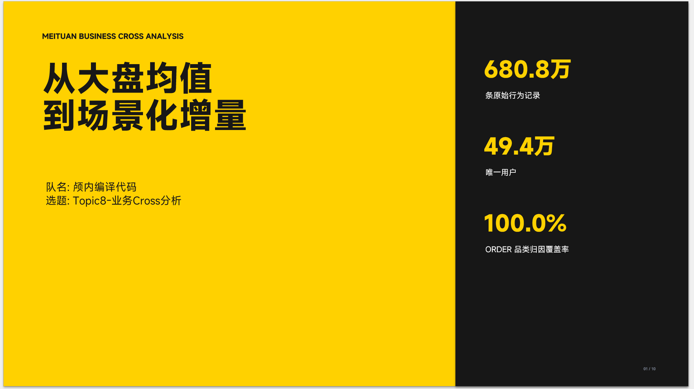
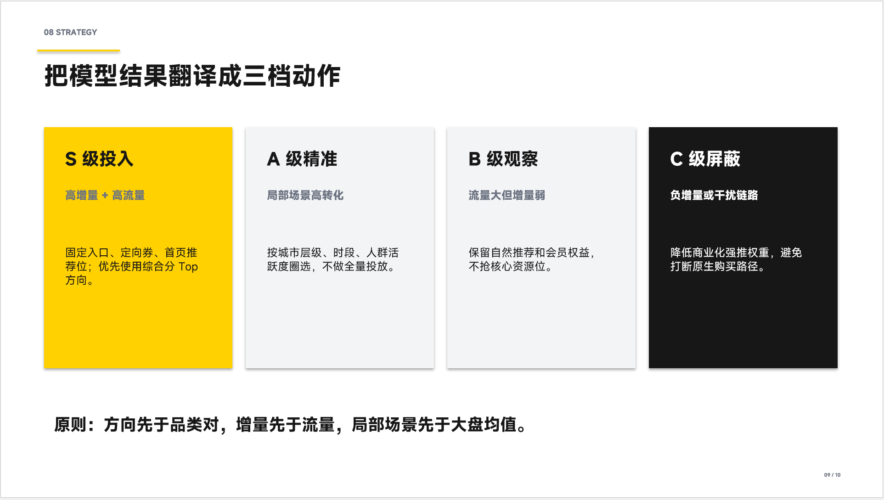
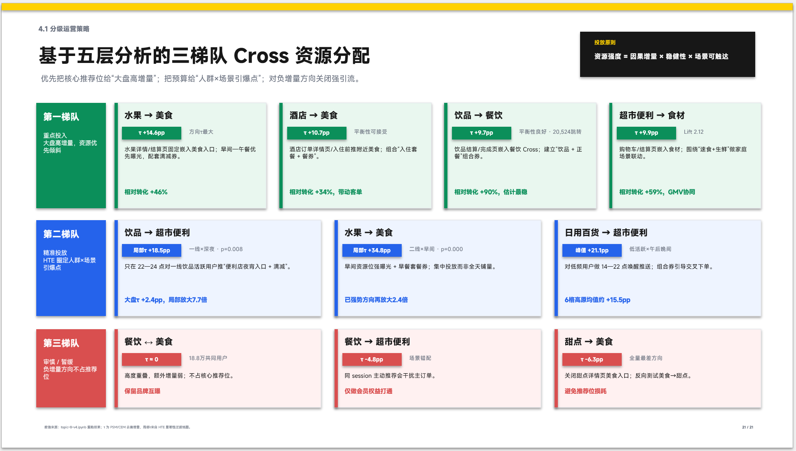

# Business Competition PPT Builder (v2)

**Business Competition PPT Builder** 是一个专为商业分析竞赛设计的自动化 PPT 生成框架。它能够将原始数据、Jupyter Notebook 分析脚本或 dataframe结果，直接转化为符合竞赛逻辑、高审美标准且逻辑严密的 15 页商业汇报演示文稿（.pptx）。

本项目不仅是一个代码库，更是一套成熟的 **商业分析叙事模版**。

## 🚀 核心特性

- **数据一致性保障**：直接从 Notebook/脚本中提取计算逻辑，确保幻灯片上的每一个 $tau$ 值、增量、置信度均与底层的分析数据源严丝合缝。
- **15 页金牌叙事结构**：内置竞赛获奖级别的 15 页幻灯片模版，涵盖：执行摘要、归因覆盖、因果增量估计（PSM/CEM）、HTE 异质性分析、策略分级等。
- **自动化视觉卡片系统**：
  - **热力图智能标注**：自动在空白处生成 `读图/结论/动作` 三段式卡片，不遮挡核心图表。
  - **策略分级看板**：根据增量正负自动生成 `重点投入 / 精准投放 / 审慎暂缓` 的彩色分级卡片。
- **专业视觉风格**：默认采用 MiSans/微软雅黑 字体，16:9 比例，配合美团黄（#FFD100）及低饱和度色系（Pale Colors），打造极致的 scannability（可扫描性）。

## 📁 目录结构

Bash

```
├── agents/             # LLM 代理配置 (OpenAI/Gemini)
├── scripts/            # 核心自动化脚本
│   ├── export_pptx.py  # 幻灯片转图片（用于预览/QA）
│   └── sanity_check.py # PPT 质量自动巡检工具
├── references/         # 方法论手册
│   ├── deck_patterns.md    # 15页叙事逻辑详解
│   ├── visual_card.md      # V2 视觉卡片设计规范
│   └── analysis_checks.md  # 数据与因果一致性校验标准
├── SKILL.md            # 工具核心指令集
└── examples/           # 示例数据与生成的 PPT 样例
```

## 🛠️ 快速开始

你可以通过以下三种方式将 `business-competition-ppt-builder` 集成到你的 AI 工作流中：

#### 方式一：一行命令安装（推荐）

Bash

```
npx skills add https://github.com/Republic1024/business-competition-ppt-builder --skill business-competition-ppt-builder
```

#### 方式二：把下面这段话直接发给 AI (Claude Code / Codex)

> 帮我安装 `business-competition-ppt-builder` 这个 AI Skill。请按以下步骤操作：
>
> 1. 确保 `~/.claude/skills/` 目录存在（不存在就创建）。
> 2. 执行 `git clone https://github.com/Republic1024/business-competition-ppt-builder.git ~/.claude/skills/business-competition-ppt-builder`。
> 3. 验证：执行 `ls ~/.claude/skills/business-competition-ppt-builder/`，确保能看到 `SKILL.md`、`scripts/`、`references/` 等核心文件。
> 4. 安装完成后告诉我。之后当我输入“基于这份数据做一份竞赛 PPT”或“优化当前的商业分析汇报”时，请自动调用该 Skill 提供的逻辑与视觉规范。

#### 方式三：手动命令行安装

如果你希望手动管理，请在终端执行：

Bash

```
# 创建目录
mkdir -p ~/.claude/skills/

# 克隆仓库
git clone https://github.com/Republic1024/business-competition-ppt-builder.git ~/.claude/skills/business-competition-ppt-builder

# 检查文件完整性
ls ~/.claude/skills/business-competition-ppt-builder/
```

------

### 💡 使用建议

安装完成后，你只需向 AI 发出类似以下指令，即可触发自动化构建流程：

- “分析 `data/` 目录下的 notebook，为我生成一份 15 页的竞赛 PPT。”
- “按照 `deck_patterns.md` 的规范，为我的因果推断结果增加 HTE 故事页。”
- “检查当前 PPT 的数据一致性，并生成对应的视觉卡片标注。”

## 🎨 视觉系统规范 (Visual System)

本项目遵循以下视觉原则：

| **模块**     | **色彩规范**          | **适用场景**                       |
| ------------ | --------------------- | ---------------------------------- |
| **核心结论** | Pale Yellow (#FFF7CC) | 执行摘要、Key Findings             |
| **正向增量** | Pale Green (#E9F7EF)  | 建议投入的策略、高 $tau$ 细分市场  |
| **精准投放** | Pale Blue (#EEF4FF)   | HTE 场景发现、用户标签细分         |
| **风险预警** | Pale Red (#FFF1F1)    | 负向增量、鲁棒性弱的结论、建议暂缓 |

## 🧠 商业分析模式

系统内置了多种分析模块，支持快速调用：

- **Executive Summary**: 3-5 个量化结论 + 对应动作。
- **Causal Increment**: 展示原始 $tau$ 与调整后（IPW/PSM）$tau$ 的对比。
- **HTE Story**: 异质性处理效应热力图及其运营转化规则。
- **Tiered Strategy**: 基于业务价值与增量稳定性的三级行动方案。

------

**注意**：本工具生成的 PPT 应被视为“证据产品”。我们始终主张：**再现性优于美观度**。所有图表均应配有对应的 `tables/*.csv` 备份以备评委溯源。





